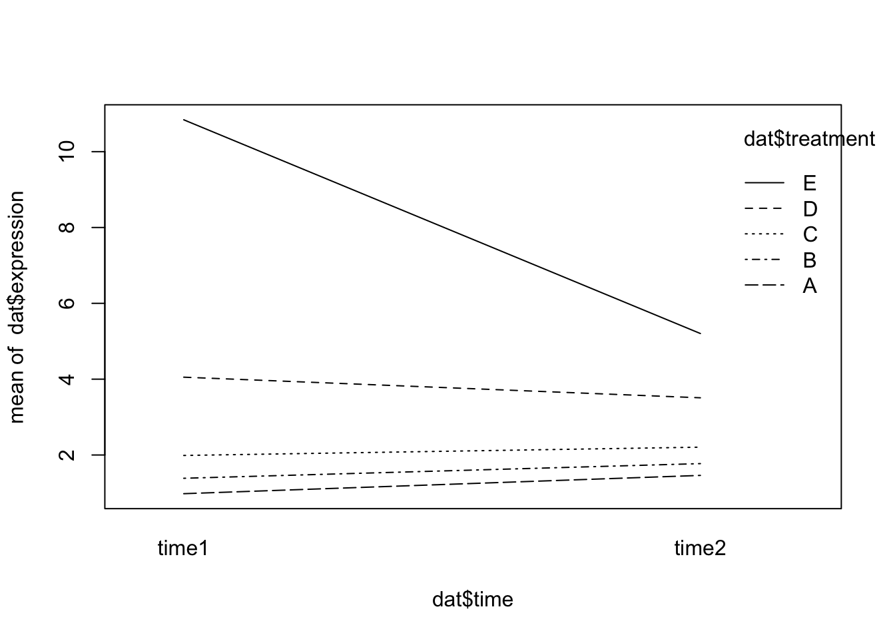

## Example count data

Let's load an example dataset from the experiment data package [pasilla](https://bioconductor.org/packages/release/data/experiment/html/pasilla.html).


::: {.cell}

```{.r .cell-code}
library(tidyverse)
library(pasilla)
```
:::


The following code loads in the gene counts data file from the package. 


::: {.cell}

```{.r .cell-code}
fn = system.file("extdata", "pasilla_gene_counts.tsv",
                  package = "pasilla", mustWork = TRUE)
counts = as.matrix(read.csv(fn, sep = "\t", row.names = "gene_id"))
```
:::


We can check the dimensions and preview the counts data. 


::: {.cell}

```{.r .cell-code}
dim(counts)
```

::: {.cell-output .cell-output-stdout}

```
[1] 14599     7
```


:::

```{.r .cell-code}
counts[ 2000+(0:3), ]
```

::: {.cell-output .cell-output-stdout}

```
            untreated1 untreated2 untreated3 untreated4 treated1 treated2
FBgn0020369       3387       4295       1315       1853     4884     2133
FBgn0020370       3186       4305       1824       2094     3525     1973
FBgn0020371          1          0          1          1        1        0
FBgn0020372         38         84         29         28       63       28
            treated3
FBgn0020369     2165
FBgn0020370     2120
FBgn0020371        0
FBgn0020372       27
```


:::
:::


The matrix tallies the number of reads seen for each gene in each sample. 
It has 14599 rows, corresponding to the genes, and 7 columns, corresponding to the samples.
When loading data from a file, a good plausibility check is to print out some of the data, and maybe not only at the very beginning, but also at some random point in the middle, as we have done above.

The table is a matrix of integer values: the value in the
$i$th row and the $j$th column of the matrix indicates how many reads have been mapped to gene $i$ in sample $j$. 

These data are from an experiment on *Drosophila melanogaster* cell cultures that investigated the effect of RNAi knock-down of the splicing factor pasilla ([Brooks et al. 2011](https://www.huber.embl.de/msmb/16-chap.html#ref-Brooks2010)) on the cells’ transcriptome. 
There were two experimental conditions, termed *untreated* and *treated* in the header of the count table that we loaded. 
They correspond to negative control and to siRNA against pasilla. 
The experimental metadata of the 7 samples in this dataset are provided in a spreadsheet-like table, which we load.


::: {.cell}

```{.r .cell-code}
annotationFile = system.file("extdata",
  "pasilla_sample_annotation.csv",
  package = "pasilla", mustWork = TRUE)
pasillaSampleAnno = readr::read_csv(annotationFile)
```

::: {.cell-output .cell-output-stderr}

```
Rows: 7 Columns: 6
── Column specification ────────────────────────────────────────────────────────
Delimiter: ","
chr (4): file, condition, type, total number of reads
dbl (2): number of lanes, exon counts

ℹ Use `spec()` to retrieve the full column specification for this data.
ℹ Specify the column types or set `show_col_types = FALSE` to quiet this message.
```


:::

```{.r .cell-code}
pasillaSampleAnno
```

::: {.cell-output .cell-output-stdout}

```
# A tibble: 7 × 6
  file    condition type  `number of lanes` total number of read…¹ `exon counts`
  <chr>   <chr>     <chr>             <dbl> <chr>                          <dbl>
1 treate… treated   sing…                 5 35158667                    15679615
2 treate… treated   pair…                 2 12242535 (x2)               15620018
3 treate… treated   pair…                 2 12443664 (x2)               12733865
4 untrea… untreated sing…                 2 17812866                    14924838
5 untrea… untreated sing…                 6 34284521                    20764558
6 untrea… untreated pair…                 2 10542625 (x2)               10283129
7 untrea… untreated pair…                 2 12214974 (x2)               11653031
# ℹ abbreviated name: ¹​`total number of reads`
```


:::
:::


As we see here, the overall dataset was produced in two batches, the first one consisting of three sequencing libraries that were subjected to single read sequencing, the second batch consisting of four libraries for which paired end sequencing was used. As so often, we need to do some data wrangling: we replace the hyphens in the `type` column by underscores, as arithmetic operators in factor levels are discouraged by DESeq2, and convert the `type` and `condition` columns into factors.


::: {.cell}

```{.r .cell-code}
pasillaSampleAnno = mutate(pasillaSampleAnno,
condition = factor(condition, levels = c("untreated", "treated")),
type = factor(sub("-.*", "", type), levels = c("single", "paired")))
```
:::


## Defining multi-factor models

Let's assume that in addition to the siRNA knockdown of the pasilla gene, we also want to test the effect of a certain drug. We could then envisage an experiment in which the experimenter treats the cells either with negative control, with the siRNA against pasilla, with the drug, or with both. To analyse this experiment, we can use the notation:

$$
y = \beta_0 + x_1\beta_1 + x_2\beta_2 + x_1x_2\beta_2
$$

This equation can be parsed as follows. The left hand side, $y$ , is the experimental measurement of interest. In our case, this is the suitably transformed expression level of a gene. Since in an RNA-Seq experiment there are lots of genes, we'll have as many copies of Equation the above equation, one for each. The coefficient $\beta_0$ is the base level of the measurement in the negative control; often it is called the intercept.

The design factors $x_1$ and $x_2$ and are binary indicator variables, sometimes called dummy variables: $x_1$ takes the value 1 if the siRNA was transfected and 0 if not, and similarly, $x_2$ indicates whether the drug was administered. In the experiment where only the siRNA is used, $x_1 = 1$ and $x_2 = 0$, and the third and fourth terms of the equation vanish. Then, the equation simplifies to $y = \beta+0 + \beta_1$. This means that $\beta_1$ represents the difference between treatment and control.

We can succinctly encode the design of the experiment in the *design matrix*. For instance, for the combinatorial experiment described above, the design matrix is

| x_0 | x_1 | x_2 |
|-----|-----|-----|
| 1   | 0   | 0   |
| 1   | 1   | 0   |
| 1   | 0   | 1   |
| 1   | 1   | 1   |

Many R packges such as `limma` and `edgeR` use the design matrix to represent experimental design.

The columns of the design matrix correspond to the experimental factors, and its rows represent the different experimental conditions, four in our case since we are including an interaction effect.

However, for the pasilla data we're not done yet. While the above equation would function if our data was perfect, in reality we have small differences between our replicates and other sources of variation in our data. We need to slightly extend the equation,

$$
y = x_{j0}\beta_0 + x_{j1}\beta_1 + x_{j2}\beta_2 + x_{j1}x_{j2}\beta_2 + \epsilon_j
$$

We have added the index $j$ and a new term $\epsilon_j$. The index $j$ now explicitly counts over our individual replicate experiments; for instance, if for each of the four conditions we perform three replicates, then $j$ counts from 1 to 12. 
The design matrix has now 12 rows, and $x_{jk}$ is the value of the matrix in its $j$th row and $k$th column. 
The additional terms $\epsilon_j$, which we call the residuals, are there to absorb differences between replicates. 
Under the assumptions of our experimental design, we require the residuals to be small. 
For instance, we can minimize the sum of the square of all the residuals, which is called least sum of squares fitting. 
The R function `lm` performs least squares.

The above is an example of a linear model. 
A linear model is a model for a continuous outcome Y of the form 

$$Y = \beta_0 + \beta_{1}X_{1} + \beta_{2}X_{2} + \dots + \beta_{p}X_{p} + \epsilon$$ 
The covariates X can be:

-   a continuous variable (age, weight, temperature, etc.)
-   Dummy variables coding a categorical covariate

The $\beta$'s are unknown parameters to be estimated.

The error term $\epsilon$ is assumed to be normally distributed with a variance that is constant across the range of the data.

Models with all categorical covariates are referred to as ANOVA models and models with continuous covariates are referred to as linear regression models. These are all linear models, and R doesn't distinguish between them.

We have already seen the t-test, but it can also be viewed as an application of the general linear model. In this case, the model would look like this:

$$
{y} = {\beta_1}*x_1 + {\beta_0}
$$ Many of the statistical tests we have seen can be represented as special cases of linear models.

## Single-factor linear models in R

R uses the function `lm` to fit linear models.

Read in 'lm_example_data.csv`:


::: {.cell}

```{.r .cell-code}
dat <- read.csv("https://raw.githubusercontent.com/ucdavis-bioinformatics-training/2018-September-Bioinformatics-Prerequisites/master/friday/lm_example_data.csv")
head(dat)
```

::: {.cell-output .cell-output-stdout}

```
  sample expression  batch treatment  time temperature
1      1  1.2139625 Batch1         A time1    11.76575
2      2  1.4796581 Batch1         A time2    12.16330
3      3  1.0878287 Batch1         A time1    10.54195
4      4  1.4438585 Batch1         A time2    10.07642
5      5  0.6371621 Batch1         A time1    12.03721
6      6  2.1226740 Batch1         B time2    13.49573
```


:::

```{.r .cell-code}
str(dat)
```

::: {.cell-output .cell-output-stdout}

```
'data.frame':	25 obs. of  6 variables:
 $ sample     : int  1 2 3 4 5 6 7 8 9 10 ...
 $ expression : num  1.214 1.48 1.088 1.444 0.637 ...
 $ batch      : chr  "Batch1" "Batch1" "Batch1" "Batch1" ...
 $ treatment  : chr  "A" "A" "A" "A" ...
 $ time       : chr  "time1" "time2" "time1" "time2" ...
 $ temperature: num  11.8 12.2 10.5 10.1 12 ...
```


:::
:::


Fit a linear model using `expression` as the outcome and `treatment` as a categorical covariate. In R model syntax, the outcome is on the left side, with covariates (separated by `+`) following the `~`:


::: {.cell}

```{.r .cell-code}
oneway.model <- lm(expression ~ treatment, data = dat)
```
:::


Note that this the same as the continuous linear model we saw earlier. 
R notices that `treatment` is a factor and handles the rest for us.


::: {.cell}

```{.r .cell-code}
oneway.model
```

::: {.cell-output .cell-output-stdout}

```

Call:
lm(formula = expression ~ treatment, data = dat)

Coefficients:
(Intercept)   treatmentB   treatmentC   treatmentD   treatmentE  
     1.1725       0.4455       0.9028       2.5537       7.4140  
```


:::

```{.r .cell-code}
class(oneway.model)
```

::: {.cell-output .cell-output-stdout}

```
[1] "lm"
```


:::
:::


We can look at the design matrix:


::: {.cell}

```{.r .cell-code}
X <- model.matrix(~treatment, data = dat)
X
```

::: {.cell-output .cell-output-stdout}

```
   (Intercept) treatmentB treatmentC treatmentD treatmentE
1            1          0          0          0          0
2            1          0          0          0          0
3            1          0          0          0          0
4            1          0          0          0          0
5            1          0          0          0          0
6            1          1          0          0          0
7            1          1          0          0          0
8            1          1          0          0          0
9            1          1          0          0          0
10           1          1          0          0          0
11           1          0          1          0          0
12           1          0          1          0          0
13           1          0          1          0          0
14           1          0          1          0          0
15           1          0          1          0          0
16           1          0          0          1          0
17           1          0          0          1          0
18           1          0          0          1          0
19           1          0          0          1          0
20           1          0          0          1          0
21           1          0          0          0          1
22           1          0          0          0          1
23           1          0          0          0          1
24           1          0          0          0          1
25           1          0          0          0          1
attr(,"assign")
[1] 0 1 1 1 1
attr(,"contrasts")
attr(,"contrasts")$treatment
[1] "contr.treatment"
```


:::
:::


Note that this is a one-way ANOVA model.

`summary()` applied to an `lm` object will give p-values and other relevant information:


::: {.cell}

```{.r .cell-code}
summary(oneway.model)
```

::: {.cell-output .cell-output-stdout}

```

Call:
lm(formula = expression ~ treatment, data = dat)

Residuals:
    Min      1Q  Median      3Q     Max 
-3.9310 -0.5353  0.1790  0.7725  3.6114 

Coefficients:
            Estimate Std. Error t value Pr(>|t|)    
(Intercept)   1.1725     0.7783   1.506    0.148    
treatmentB    0.4455     1.1007   0.405    0.690    
treatmentC    0.9028     1.1007   0.820    0.422    
treatmentD    2.5537     1.1007   2.320    0.031 *  
treatmentE    7.4140     1.1007   6.735 1.49e-06 ***
---
Signif. codes:  0 '***' 0.001 '**' 0.01 '*' 0.05 '.' 0.1 ' ' 1

Residual standard error: 1.74 on 20 degrees of freedom
Multiple R-squared:  0.7528,	Adjusted R-squared:  0.7033 
F-statistic: 15.22 on 4 and 20 DF,  p-value: 7.275e-06
```


:::
:::


In the output:

-   "Coefficients" refer to the $\beta$'s
-   "Estimate" is the estimate of each coefficient
-   "Std. Error" is the standard error of the estimate
-   "t value" is the coefficient divided by its standard error
-   "Pr(\>\|t\|)" is the p-value for the coefficient
-   The residual standard error is the estimate of the variance of $\epsilon$
-   Degrees of freedom is the sample size minus \# of coefficients estimated
-   R-squared is (roughly) the proportion of variance in the outcome explained by the model
-   The F-statistic compares the fit of the model *as a whole* to the null model (with no covariates)

`coef()` gives you model coefficients:


::: {.cell}

```{.r .cell-code}
coef(oneway.model)
```

::: {.cell-output .cell-output-stdout}

```
(Intercept)  treatmentB  treatmentC  treatmentD  treatmentE 
  1.1724940   0.4455249   0.9027755   2.5536669   7.4139642 
```


:::
:::


What do the model coefficients mean?

By default, R uses reference group coding or "treatment contrasts". For categorical covariates, the first level alphabetically (or first factor level) is treated as the reference group. The reference group doesn't get its own coefficient, it is represented by the intercept. Coefficients for other groups are the difference from the reference:

For our simple design:

-   `(Intercept)` is the mean of expression for treatment = A
-   `treatmentB` is the mean of expression for treatment = B minus the mean for treatment = A
-   `treatmentC` is the mean of expression for treatment = C minus the mean for treatment = A
-   etc.


::: {.cell}

```{.r .cell-code}
# Get means in each treatment
treatmentmeans <- tapply(dat$expression, dat$treatment, mean)
treatmentmeans["A"] 
```

::: {.cell-output .cell-output-stdout}

```
       A 
1.172494 
```


:::

```{.r .cell-code}
# Difference in means gives you the "treatmentB" coefficient from oneway.model
treatmentmeans["B"] - treatmentmeans["A"] 
```

::: {.cell-output .cell-output-stdout}

```
        B 
0.4455249 
```


:::
:::


What if you don't want reference group coding? Another option is to fit a model without an intercept:


::: {.cell}

```{.r .cell-code}
no.intercept.model <- lm(expression ~ 0 + treatment, data = dat) # '0' means 'no intercept' here
summary(no.intercept.model)
```

::: {.cell-output .cell-output-stdout}

```

Call:
lm(formula = expression ~ 0 + treatment, data = dat)

Residuals:
    Min      1Q  Median      3Q     Max 
-3.9310 -0.5353  0.1790  0.7725  3.6114 

Coefficients:
           Estimate Std. Error t value Pr(>|t|)    
treatmentA   1.1725     0.7783   1.506 0.147594    
treatmentB   1.6180     0.7783   2.079 0.050717 .  
treatmentC   2.0753     0.7783   2.666 0.014831 *  
treatmentD   3.7262     0.7783   4.787 0.000112 ***
treatmentE   8.5865     0.7783  11.032 5.92e-10 ***
---
Signif. codes:  0 '***' 0.001 '**' 0.01 '*' 0.05 '.' 0.1 ' ' 1

Residual standard error: 1.74 on 20 degrees of freedom
Multiple R-squared:  0.8878,	Adjusted R-squared:  0.8598 
F-statistic: 31.66 on 5 and 20 DF,  p-value: 7.605e-09
```


:::

```{.r .cell-code}
coef(no.intercept.model)
```

::: {.cell-output .cell-output-stdout}

```
treatmentA treatmentB treatmentC treatmentD treatmentE 
  1.172494   1.618019   2.075270   3.726161   8.586458 
```


:::
:::


Without the intercept, the coefficients here estimate the mean in each level of treatment:


::: {.cell}

```{.r .cell-code}
treatmentmeans
```

::: {.cell-output .cell-output-stdout}

```
       A        B        C        D        E 
1.172494 1.618019 2.075270 3.726161 8.586458 
```


:::
:::


The no-intercept model is the SAME model as the reference group coded model, in the sense that it gives the same estimate for any comparison between groups:

Treatment B - treatment A, reference group coded model:


::: {.cell}

```{.r .cell-code}
coefs <- coef(oneway.model)
coefs["treatmentB"]
```

::: {.cell-output .cell-output-stdout}

```
treatmentB 
 0.4455249 
```


:::
:::


Treatment B - treatment A, no-intercept model:


::: {.cell}

```{.r .cell-code}
coefs <- coef(no.intercept.model)
coefs["treatmentB"] - coefs["treatmentA"]
```

::: {.cell-output .cell-output-stdout}

```
treatmentB 
 0.4455249 
```


:::
:::


## Batch Adjustment

Suppose we want to adjust for batch differences in our model. We do this by adding the covariate "batch" to the model formula:


::: {.cell}

```{.r .cell-code}
batch.model <- lm(expression ~ treatment + batch, data = dat)
summary(batch.model)
```

::: {.cell-output .cell-output-stdout}

```

Call:
lm(formula = expression ~ treatment + batch, data = dat)

Residuals:
    Min      1Q  Median      3Q     Max 
-3.9310 -0.8337  0.0415  0.7725  3.6114 

Coefficients:
            Estimate Std. Error t value Pr(>|t|)    
(Intercept)   1.1725     0.7757   1.512 0.147108    
treatmentB    0.4455     1.0970   0.406 0.689186    
treatmentC    1.9154     1.4512   1.320 0.202561    
treatmentD    4.2414     1.9263   2.202 0.040231 *  
treatmentE    9.1017     1.9263   4.725 0.000147 ***
batchBatch2  -1.6877     1.5834  -1.066 0.299837    
---
Signif. codes:  0 '***' 0.001 '**' 0.01 '*' 0.05 '.' 0.1 ' ' 1

Residual standard error: 1.735 on 19 degrees of freedom
Multiple R-squared:  0.7667,	Adjusted R-squared:  0.7053 
F-statistic: 12.49 on 5 and 19 DF,  p-value: 1.835e-05
```


:::

```{.r .cell-code}
coef(batch.model)
```

::: {.cell-output .cell-output-stdout}

```
(Intercept)  treatmentB  treatmentC  treatmentD  treatmentE batchBatch2 
  1.1724940   0.4455249   1.9153967   4.2413688   9.1016661  -1.6877019 
```


:::
:::


For a model with more than one coefficient, `summary` provides estimates and tests for each coefficient adjusted for all the other coefficients in the model.

## Two-factor analysis

Suppose our experiment involves two factors, treatment and time. `lm` can be used to fit a two-way ANOVA model:


::: {.cell}

```{.r .cell-code}
twoway.model <- lm(expression ~ treatment*time, data = dat)
summary(twoway.model)
```

::: {.cell-output .cell-output-stdout}

```

Call:
lm(formula = expression ~ treatment * time, data = dat)

Residuals:
    Min      1Q  Median      3Q     Max 
-2.0287 -0.4463  0.1082  0.4915  1.7623 

Coefficients:
                     Estimate Std. Error t value Pr(>|t|)    
(Intercept)           0.97965    0.69239   1.415  0.17752    
treatmentB            0.40637    1.09476   0.371  0.71568    
treatmentC            1.00813    0.97918   1.030  0.31953    
treatmentD            3.07266    1.09476   2.807  0.01328 *  
treatmentE            9.86180    0.97918  10.071 4.55e-08 ***
timetime2             0.48211    1.09476   0.440  0.66594    
treatmentB:timetime2 -0.09544    1.54822  -0.062  0.95166    
treatmentC:timetime2 -0.26339    1.54822  -0.170  0.86718    
treatmentD:timetime2 -1.02568    1.54822  -0.662  0.51771    
treatmentE:timetime2 -6.11958    1.54822  -3.953  0.00128 ** 
---
Signif. codes:  0 '***' 0.001 '**' 0.01 '*' 0.05 '.' 0.1 ' ' 1

Residual standard error: 1.199 on 15 degrees of freedom
Multiple R-squared:  0.912,	Adjusted R-squared:  0.8591 
F-statistic: 17.26 on 9 and 15 DF,  p-value: 2.242e-06
```


:::

```{.r .cell-code}
coef(twoway.model)
```

::: {.cell-output .cell-output-stdout}

```
         (Intercept)           treatmentB           treatmentC 
          0.97965110           0.40636785           1.00813264 
          treatmentD           treatmentE            timetime2 
          3.07265513           9.86179766           0.48210723 
treatmentB:timetime2 treatmentC:timetime2 treatmentD:timetime2 
         -0.09544075          -0.26339279          -1.02568281 
treatmentE:timetime2 
         -6.11958364 
```


:::
:::


The notation `treatment*time` refers to treatment, time, and the interaction effect of treatment by time.

Interpretation of coefficients:

-   Each coefficient for treatment represents the difference between the indicated group and the reference group *at the reference level for the other covariates*
-   For example, "treatmentB" is the difference in expression between treatment B and treatment A at time 1
-   Similarly, "timetime2" is the difference in expression between time2 and time1 for treatment A
-   The interaction effects (coefficients with ":") estimate the difference between treatment groups in the effect of time
-   The interaction effects ALSO estimate the difference between times in the effect of treatment

To estimate the difference between treatment B and treatment A at time 2, we need to include the interaction effects:


::: {.cell}

```{.r .cell-code}
# A - B at time 2
coefs <- coef(twoway.model)
coefs["treatmentB"] + coefs["treatmentB:timetime2"]
```

::: {.cell-output .cell-output-stdout}

```
treatmentB 
 0.3109271 
```


:::
:::


We can see from `summary` that one of the interaction effects is significant. Here's what that interaction effect looks like graphically:


::: {.cell}

```{.r .cell-code}
interaction.plot(x.factor = dat$time, trace.factor = dat$treatment, response = dat$expression)
```

::: {.cell-output-display}
{width=672}
:::
:::


## Specialized models for biological data

Let's now return to the pasilla dataset.
This high-throughput count data contains a number of complexities which necessitate a specialized model, including:

-   The data have a large dynamic range, starting from zero up to millions. The variance, and more generally, the distribution shape of the data in different parts of the dynamic range are very different. We need to take this phenomenon, called heteroskedasticity, into account.

-   The data are non-negative integers, and their distribution is not symmetric -- thus normal or log-normal distribution models may be a poor fit.

-   We need to understand the systematic sampling biases and adjust for them. This is often called normalization, but has a different meaning from other types of normalization. Examples are the total sequencing depth of an experiment (even if the true abundance of a gene in two libraries is the same, we expect different numbers of reads for it depending on the total number of reads sequenced), or differing sampling probabilities (even if the true abundance of two genes within a biological sample is the same, we expect different numbers of reads for them if their biophysical properties differ, such as length, GC content, secondary structure, binding partners).

Luckily, in R we have highly specialized methods for preparing and analyzing high-throughput biological data such as those found in `DESeq2`, `EdgeR`, `limma`, and `seurat`.

Let's briefly walk through setting up a model for the `pasilla` data using DESeq2.
DESeq2 uses a specialized data container, called `DESeqDataSet` to store the datasets it works with. 
`DESeqDataSet` is an extension of the class `SummarizedExperiment` in Bioconductor. The `SummarizedExperiment` class is also used by many other packages, so learning to work with it will enable you to use quite a range of tools.


::: {.cell}

```{.r .cell-code}
mt = match(colnames(counts), sub("fb$", "", pasillaSampleAnno$file))
stopifnot(!any(is.na(mt)))

pasilla = DESeqDataSetFromMatrix(
  countData = counts,
  colData   = pasillaSampleAnno[mt, ],
  design    = ~ condition)
```
:::


In the pasilla data, we can consider the affects of both the `type` and `condition` variables.


::: {.cell}

```{.r .cell-code}
pasillaTwoFactor = pasilla
design(pasillaTwoFactor) = formula(~ type + condition)
pasillaTwoFactor = DESeq(pasillaTwoFactor)
```
:::


We access the results using the `results` function, which returns a dataframe with the statistics of each gene.


::: {.cell}

```{.r .cell-code}
res2 = results(pasillaTwoFactor)
head(res2, n = 3)
```

::: {.cell-output .cell-output-stdout}

```
log2 fold change (MLE): condition treated vs untreated 
Wald test p-value: condition treated vs untreated 
DataFrame with 3 rows and 6 columns
             baseMean log2FoldChange     lfcSE       stat    pvalue      padj
            <numeric>      <numeric> <numeric>  <numeric> <numeric> <numeric>
FBgn0000003  0.171569      0.6745518  3.871091  0.1742537  0.861666        NA
FBgn0000008 95.144079     -0.0406731  0.222215 -0.1830351  0.854770  0.951975
FBgn0000014  1.056572     -0.0849880  2.111821 -0.0402439  0.967899        NA
```


:::
:::


------------------------------------------------------------------------

*The materials in this lesson have been adapted from:* - [*Statistical Thinking for the 21st Century*](https://statsthinking21.github.io/statsthinking21-core-site/index.html) *by Russell A. Poldrack. This work is distributed under the terms of the [Attribution-NonCommercial 4.0 International](https://creativecommons.org/licenses/by-nc/4.0/) (CC BY-NC 4.0), which permits unrestricted use, distribution, and reproduction in any medium, provided the original author and source are credited and the material is used for noncommercial purposes.* - [*Modern Statistics for Modern Biology*](https://www.huber.embl.de/msmb/) *by Susan Holmes and Wolfgang Huber. This work is distributed under the terms of the [Attribution-NonCommercial-ShareAlike 2.0 Generic](https://creativecommons.org/licenses/by-nc-sa/2.0/) (CC BY-NC-SA 2.0), which permits unrestricted use, distribution, and reproduction in any medium, provided the original author and source are credited, the material is used for noncommercial purposes, and the same license is used for any derivative material. and the UCDavis Bioinformatics Core*
